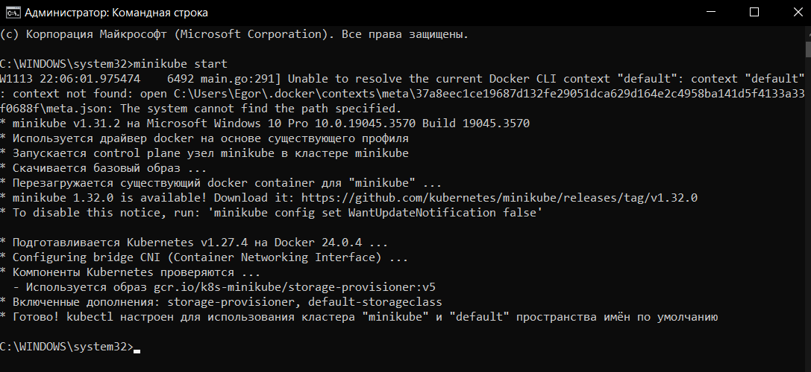
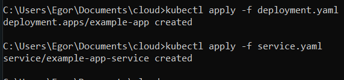
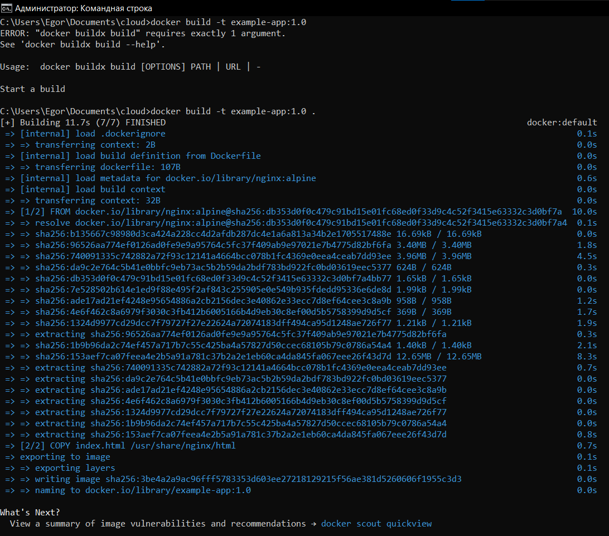
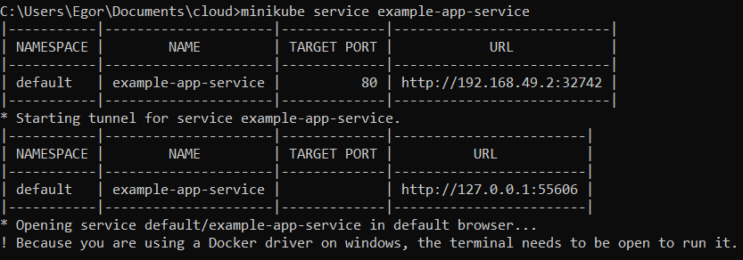
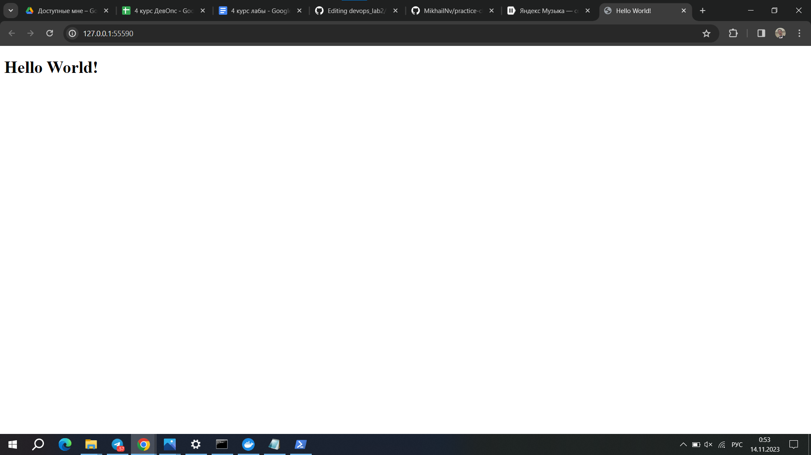

## Цель работы:
Локально поднять kubernetes и запустить в нём свой сервис

## Задачи:
* Установить и запустить minikube;
* Написать 2 YAML файла для сервиса;
* Собрать и запустить сервис.

## Ход работы

Установим minikube, а затем запустим его следующей командой 
  ```
  minikube start
  ```



Создадим Deployment YAML файл deployment.yaml со следующим содержимым
  ```
apiVersion: apps/v1
kind: Deployment
metadata:
  name: example-app
spec:
  replicas: 2
  selector:
    matchLabels:
      app: example-app
  template:
    metadata:
      labels:
        app: example-app
    spec:
      containers:
        - name: example-app
          image: example-app:1.0
          ports:
            - containerPort: 80

  ```
Теперь нам потребуется создать Service YAML файл service.yaml
  ```
apiVersion: v1
kind: Service
metadata:
  name: example-app-service
spec:
  selector:
    app: example-app
  ports:
    - protocol: TCP
      port: 80
      targetPort: 80
  type: NodePort
  ```
Напишем саму страничку нашего сервиса на HTML
  ```
<!-- index.html -->
<!DOCTYPE html>
<html lang="en">
<head>
    <meta charset="UTF-8">
    <meta name="viewport" content="width=device-width, initial-scale=1.0">
    <title>Hello World!</title>
</head>
<body>
    <h1>Hello World!</h1>
</body>
</html>
  ```
Ну и конечно же создадим Dockerfile, который будет копировать этот файл в образ Nginx
  ```
# Dockerfile
FROM nginx:alpine
COPY index.html /usr/share/nginx/html
  ```
Теперь нам необходимо применить наши YAML файлы и собрать приложение

Применение YAML файлов



Сборка приложения



Теперь введем следующую команду

  ```
minikube service example-app-service
  ```
Она покажет нам внешний IP по которому доступен наш сервис



А также мгновенно откроет браузер с нашим сервисом



## Вывод
В данной лабораторной работе нами были созданы 2 YAML файла для создания локального kubernetes кластера, а также развернут сервис одной командой запуска. Во время выполнения лабораторной работы проблем не возникло.

## Выполнили
Студенты группы К34211: Наумов М., Захаров Е. и Коркунов. Ф
